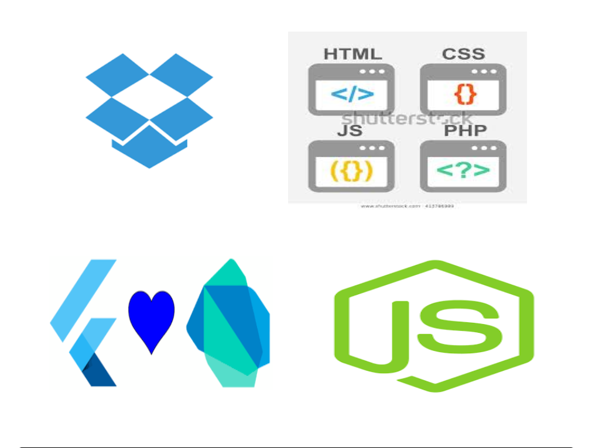

<html> 
<head> 
     <meta name="viewport" content="width=device-width, initial-scale=1.0">
	<title>Technex Hackaton 2020</title> 
	 
</head> 

<body style="background-color:#FFFFFF;">
   

      <h1>
Duoly Done Authorization System(DDAS)
</h1>
   

    

    <!--Objective-->
       
    
<h2>Objective</h2>
      
<h3>Our project focus on the Double Authentication of transactions made in co-operate firms for the transactions which are really huge for the firm or above clearence level of the employee handling that transactions. As well as, For small transactions,transaction will be hassle free even for lower level employees. Limit can be decided and will be seted and changed by admins any time. </h3>
 

  

  
<h2>Workflow</h2>
      
<h3>1. Client will initiate a payment(s) through ERP. 2. Transaction should be put on hold for clients where re-authorization / secondary authorization is enabled. 3. Based on the amount authorization engine should be able to trigger / seek approvals from required authorizers.  Authorization can be orchestrated using separate App can be built where approvals can be taken and re-directed back to the app for Approval mechanism needs to be password based followed with second factor authentication using OTP.</h3>
 

<!--Technology used-->
  
<h2 >Technology Used</h2>
  
<h3><ul type=""><li>Flutter</li><li>Dropbox</li><li>Node.js</li></ul></h3>

  
  

<a href="https://www.dropbox.com/s/5n2l8hpt8pinag8/TorrDroid%20Torrent%20Downloader_v1.5.5_apkpure.com.apk?dl=1" download="Hii.pdf"><button class="button">Click Here to Download</button></a>

	</body> 
</html>		 
